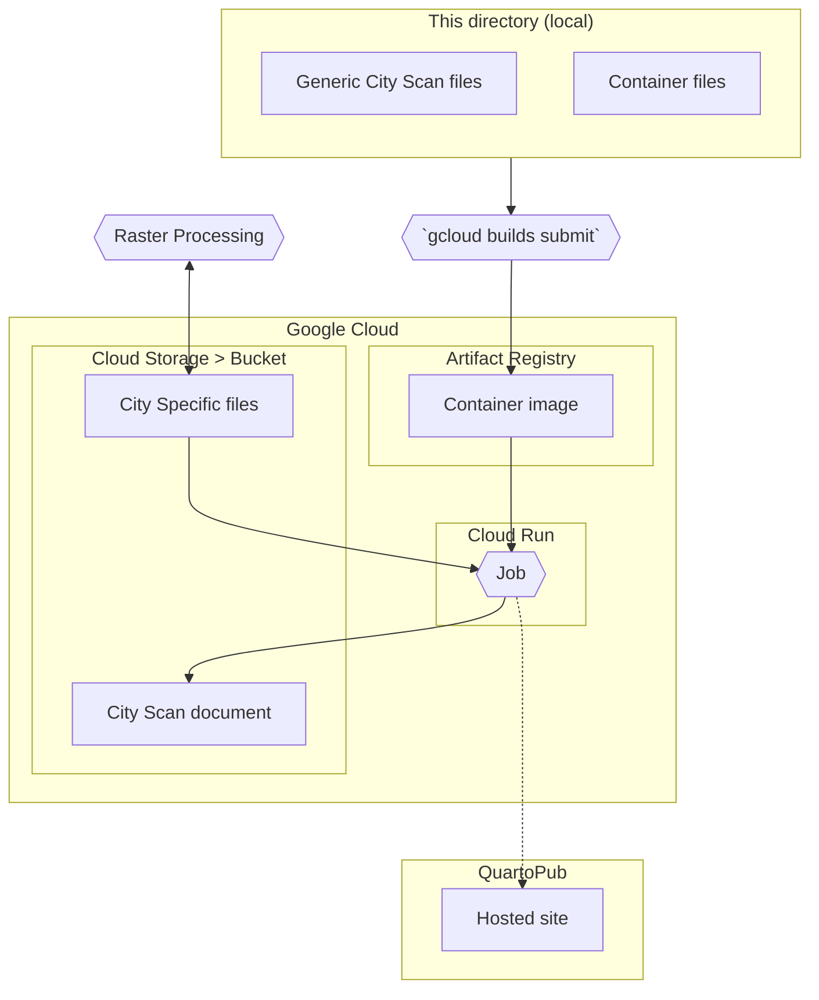

# City Scan Frontend <!-- omit in toc -->

This directory renders a City Scan as a static site webpage filled with backend-generated source material (to be located in `mnt/`), using [Quarto](https://quarto.org).

The primary file is `index.qmd` which Quarto converts to HTML; `index.qmd` is a markdown document with additional capacity to execute chunks of R, Python and Observable-flavored JavaScript (OJS). (Right now the QMD is written in R and OJS but the R could be converted to Python.)

This directory includes both the files for creating a scan (and a template for other scans), and the files for building the scan using Google Cloud. First we will look into creating a scan and its template, and then we will complicate things by doing so in Docker and on Google Cloud.

## Table of Contents <!-- omit in toc -->
- [The lay of the land…](#the-lay-of-the-land)
- [Making changes](#making-changes)
	- [`index.qmd`](#indexqmd)
		- [Structure](#structure)
		- [Creating the map layer](#creating-the-map-layer)
		- [Printing the text](#printing-the-text)
	- [`layers.yml`](#layersyml)
		- [Parameters](#parameters)
	- [`generic-text.yml`](#generic-textyml)
	- [`manual-text.md`](#manual-textmd)
- [Docker \& Google Cloud](#docker--google-cloud)
	- [Using Google Cloud](#using-google-cloud)
	- [Directory Contents](#directory-contents)
		- [Files for rendering the document](#files-for-rendering-the-document)
		- [Files for building the container](#files-for-building-the-container)
	- [Running locally](#running-locally)
	- [Setting up on Google Cloud](#setting-up-on-google-cloud)
		- [Set environment variables](#set-environment-variables)
		- [Google Cloud Storage](#google-cloud-storage)
		- [Service account](#service-account)
		- [Build the container](#build-the-container)
			- [Building container locally](#building-container-locally)
		- [Job creation and execution](#job-creation-and-execution)
			- [Running container locally](#running-container-locally)

## The lay of the land…

For all scans
- `index.qmd` – The main file which Quarto builds the document from; a Quarto file (QMD) is a markdown file that can execute Python, R, and ObservableJS chunks
- `source/fns.R` – The R functions used by `index.qmd`; these functions mainly consist of mapmaking functions that style the rasters for interactive (leaflet) and static (ggplot2) plots
- `source/scrollytelling.qmd` – The ObservableJS code needed for the scrollytelling (the feature where the map layers turn on when the relevant section is scrolled to)
- `source/layers.yml` – The recipe for how each map layer is made (this may be moved out of the container and onto Google Cloud, but probably best for it to stay here with a way to override it with a file in Google Cloud Storage)
- `source/custom.scss` – The document's style sheet (note that it is a [*SASS*](https://sass-lang.com) file, rather than a *CSS* file)
- `source/generic-text.yml` – the text snippets used by all City Scans, such as methodology text and citations.

For a particular scan
- `mnt/<city-directory>/01-user-input/city_inputs.yml`
- `mnt/<city-directory>/01-user-input/text-files/manual-text.md`
- geospatial data, such as GeoTIFFs

## Making changes

Let's consider 3 scenarios in which you want to modify this site:

1. You want to keep the template entirely the same, but you want to use it for a new city.
  - ⟹ Change the city details in `city_inputs.yml`, such as the city and country name
  - ⟹ Write takeaway bullets interpretting the slides and charts in `manual-text.md` (do this after generating a version of the scan *without* any text inputs, so you can view the maps while writing)
2. You want to keep the template mostly the same, but you want to modify or add some template slides
  - ⟹ Add symbology details (map palette, number of bins, etc.) for the new slides, or revise the details of existing slides, in `layers.yml`
  - ⟹ Add/remove relevant "chunks" to `index.qmd`
  - ⟹ Edit the template text in `generic-text.yml`
3. You want to repurpose the template for a new kind of scan (e.g. a WASH scan)
  - ⟹ Replace chunks in `index.qmd`, replace symbologies in `layers.yml`, and replace template text in `generic-text.yml`
  - ⟹ Potentially make adjustments to `fns.R`, `scrollytelling.qmd` and `custom.scss`

### `index.qmd`

`index.qmd` provides the site's skeletal structure. It is essentially an R markdown notebook or a Jupyter notebook that can execute Python, R, and JavaScript. This file gathers all of the content we want in the final document. Currently, it also creates the maps from the geospatial data, though we might want to move this to a separate file.

#### Structure

- YAML frontmatter
  - Sandwiched by `---`
  - This tells Quarto to use `custom.scss` as the stylesheet when rendering, and it sets the default chunk execution options (namely, that we don't want to see the code itself nor its output in the final document
  - Typically, this frontmatter would also include the document's title, but we are delaying that until later in the document
- `:::setup`
  - The document continues by laying some groundwork for the rest of the file, and shouldn't really need meddling
  - It reads the functions file, the city inputs file, the text files, and sets visualization parameters
  - See how all of this is surrounded by fencing, `:::setup` and `:::`, which tell the renderer that this all belongs in one HTML `<div class="setup">`. 
- `:::topbar` `:::navigation`
  - This section, which yields `<div class="topbar"><div class="navigation"></div></div>`, creates a navigation menu based on the headers in `index.qmd`
  - This could probably be done more efficiently.
- `:::text-column`
  - This section includes all of the left-side content of the site
  - It also creates all of the map layers, but doesn't show them (for scrollytelling reasons)
  - Note that this section begins with `:::text-column` and ends with `:::`, which creates `<div class="text-column>`
- `:::maps`
  - This is where all of the map layers are ultimately shown
  - We have built the map layers above but now we want to show them all at once, on a single basemap
  - Over the course of text-column, we have been adding each new layer to the `all_maps` object

#### Creating the map layer

Each map layer begins with a level-3 header (e.g., `### Population density`). This is the title that will appear on the lefthand side and is also the label (at least for now) that is used to show/hide the map layers.

Then, each map layer requires two chunks:
1. a chunk for creating the map layer
2. a chunk for printing the text

```{r}
#| include: false
# Read population data
pop <- fuzzy_read(spatial_dir, "population", rast)

# Interactive Plot (Leaflet)
add_pop_layer <- create_layer_function(data = rast_as_vect(pop), yaml_key = "population")
all_maps <- add_pop_layer(all_maps)
  # This could be put into the add_*_layer() functions themselves
  # hideGroup("population-density")
added_layers <- c(added_layers, "population-density")

# Static plot (PNG)
plot_pop <- plot_static(data = pop, yaml_key = "population")
save_plot(plot = plot_pop, filename = "pop.png", directory = styled_maps_dir)
```

The chunk that creates the map layer does not show any output: we are simply saving the newly created map layer to `all_maps`, which we will show at the very end. To hide all output, set `#| include: false` at the top of the chunk.

In this chunk we first read in the relevant data. (Because naming hasn't been consistent, I wrote a function called `fuzzy_read()`, but this is unnecessary if the geospatial file are named in a standardized pattern.)

Next, we create the map layer, simply by putting the spatial data as the first argument in `create_layer_function()`, and the layer's key in `layers.yml` as the `yaml_key` (see [layers.yml](#layers-yml)). This function should work for **all** map layers, and these two arguments should be sufficient for most map layers. Note, though, that if you would like to override any symbology styles from `layers.yml`, you can include these as arguments in the function (e.g., `create_layer_function(data = pop, yaml_key = "population", bins = 0)`, which would change the population layer from showing binned values to continuous data.) Also note that `create_layer_function()` can take either raster or vector data, but in most cases vector data is prefered because it allows a hover tooltip in the interactive map.

We then employ this new layer-creating function to add the layer to the existing stack of map layers, `all_maps`. This object was created in the setup section, with `all_maps <- plot_basemap("vector")`. We also need to add this layer's group id (which is used to turn the layers on and off) to a running list, `added_layers`; this will be necessary for adding a control panel to the maps at the end. **It is important that this group id matches `group_id` in `layers.yml` and that it matches a "slugified" version of the layer's level-3 header, where all letters are low case, spaces are dashes, and everything else is removed.** For example, the group id for `### Population Density` would be `population-density`.

After making the interactive map layers, we make static versions of the map for a PDF version. For this, we use `plot_static()`, which similarly takes the geospatial data (here, raster is better, for speed) and the `yaml_key`.

#### Printing the text

```{r}
#| output: asis
print_slide_text(slide_texts$demographics$population_density)
```

The other chunk for each layer outputs the text. This text includes the template text which is the same for all scans with that layer (from `generic-text.yml`), and the interpretative text specific to that city (from `manual-text.md`). One undiscussed part of the setup section above is to combine these two files into a merged list named `slide_texts`. Now, for each slide, we simply need to call these pieces of text using `print_slide_text()`. The name after the first `$` is the section and the name after the second `$` is the slide name. The names of the sections and the slides need to be the same in `generic-text.yml` and `manual-text.md`. These names do not need to match the level-3 header in `index.qmd`.

### `layers.yml`

All of the symbology for each layer is defined in `layers.yml`. This way, you don't need to work with R or JavaScript to style your maps.

In this file, each layer contains a series of key-value pairs defining parameters such as the color palette, the number of bins, the legend title, etc.

```{yaml}
population:
  title: 'Population density'
  subtitle: 'Number of persons per 10,000 m^2^'
  palette: ['#ECEB72', '#8E3933']
  bins: 5
  group_id: 'population-density'
```

#### Parameters

*The simplest layers will only need a few parameters, such as `title`, `palette`, and `group_id`. The other parameters give you more control over the layer's styling.

- `title:` title to be used in the legend
- `subtitle:` subtitle to be used in the legend
- `group_id:`
  - the id used to turn the layer on and off
  - **this id must match the layer's level-3 header in `index.qmd`, in lowercase "slugified" form**, where dashes replace all white space and all punctuation is removed
- `palette:` 
  - colors to be used in the map layer
  - palette can be a pair of colors for the minimum and maximum or can include values for in-between values
  - if the `center` parameter is set, the middle color will be used for the center
- `bins:`
  - the number of bins to break the symbology and legend into
  - for continuous data, use 0
- `factor`: 
  - logical; default false
  - set to true if you want to set a specific color to each value in the data
- `breaks:`
  - use this to set the cut points for the bins
  - breaks needs to include the lower and upper limits (so, unless `factor = TRUE`, there should be `# of bins + 1` breaks
  - the default value is to use "prettified" quantile breaks[^pretty-breaks]
  - for factor data, these are the values of each factor level
- `labels`:
  - the text labels that correspond to the breaks
  - for non-factor data, the text labels correspond to the *gaps between the breaks*, so there should be one fewer labels than breaks
  - for factor data, the text labels are the labels for each factor level
- `center`: the value that should be at the center of the color palette
- `suffix`: suffix to be added to the legend labels (e.g. "°C" for land surface temperature)
- `alpha`: similar to palette, these are the opacity values for the layer (*in development*)
- `stroke` & `weight`: 
  - the color and lineweight of the stroke
  - by default, there is no stroke

[^pretty-breaks]: In "prettified" breaks, the breaks are set near `100/(# of bins)`^th^ quantile, while reducing the the significant digits and maintaining good separation. E.g, for `bins = 4`, the breaks are first set at the 25^th^, 50^th^, 75^th^ and 100^th^ quantiles; the values associated with these quantiles are then simplified by reducing the significant digits, but only to the extent that the new quantiles are still rather far apart.

### `generic-text.yml`

The template text is written in `generic-text.yml`, while the city-specific text is written in `manual-text.md`. `generic-text.yml` is a YAML file, organized into sections and slides (from when the City Scan was a slide-based document).

Each slide can contain method text, which describes the methodology of the layer and provides helpful information that is relevant to how to interpret the data being shown (as opposed to interpretation itself) and footnote text, such as data attribution. For example, here is the text for the solar potential slide:

```{yaml}
  solar:
    method: Solar electricity offers a unique opportunity to achieve long-term energy sustainability goals. Photovoltaics (PV) is the most widely applied and versatile technology for solar power. The availability of solar energy depends on site conditions. This map displays an indicative estimate of annual specific yield, that is, how much energy a hypothetical PV system would produce for per unit of capacity, in a given year (kWh/kWp). Values above 1,640  are considered excellent availability, while values between 1280 and 1640 are moderate.
    footnote: |
      Map data obtained from the “Global Solar Atlas 2.0, a free, web-based application is developed and operated by the company Solargis s.r.o. on behalf of the World Bank Group, utilizing Solargis data, with funding provided by the Energy Sector Management Assistance Program (ESMAP). For additional information: https://globalsolaratlas.info
      The Global Solar Atlas uses generalized theoretical settings for a quick assessment of PV power potential for a selected site. An optimum tilt angle of PV modules and 100% availability (no shutdowns due to failure) are assumed.
```

The "|" on the first line of `footnote` tells the file there are multiple lines of text for the `footnote` key. Each new line is a new paragraph.

### `manual-text.md`

The city-specific text, which includes the takeaway bullets for each map layer, is a modified markdown document, where each section is delimited with four slashes (`////`) and each slide is designated with two (`//`). **These section and slide markers must match the keys in `generic-text.yml`.** In setting up a template, simpy make sure that all the relevant section and slide markers are included.

## Docker & Google Cloud

If your computer environment is all set up for it (similarly enough to mine), you could simply render the site by running `quarto render index.qmd`.

It is likely, though, that your computer is not set up like mine, in which case: cue **docker**. Docker allows us to create an image of the necessary computing environment, with all the appropriate dependencies, for our purposes. We can run this image as a container, and in that container render the site. (See [Building container locally](#building-container-locally) and [Running container locally](#running-container-locally)).

But what if you don't want to run locally *at all*!? Running locally means you still need to get the raster files from somewhere, and they're being processed on Google Cloud. So that introduces the second level (third? fourth?) level of abstraction: we run the docker container on **Google Cloud**.

*(The below was written first; it could be fettled significantly.)*

### Using Google Cloud

To create the a City Scan document using Google Cloud, we execute a job on Cloud Run[^1]. The job runs a Docker container, which is built from this directory. In order to use files created previously on Google Cloud and to spit out the results for later access, we need to [*mount*](https://cloud.google.com/run/docs/tutorials/network-filesystems-fuse) the container to a Google Cloud Storage *bucket* (this mounting occurs in the `gcsfuse_run.sh` file).

[^1]: "Cloud Run is a managed compute platform that lets you run containers directly on top of Google's scalable infrastructure." ([→documentation](https://cloud.google.com/run/docs/overview/what-is-cloud-run))

This is lots of jargon! Let's illustrate and dilate the process a bit:



1. We begin with the **files necessary to render a City Scan document**. With `quarto render index.qmd` these files could be used to make the document locally.
   1. Generic files: i.e., `index.qmd`, `source/fns.R`, `source/scrollytelling.qmd`, `source/layers.yml`, `source/custom.scss`, `source/generic-text.yml`, these are the files used by every scan. These files are included in *this directory*.
   2. City-specific files: e.g. `city_inputs.yml` and the TIFS used to make the maps. These files *are not* included in this directory.
   3. See [below](#running-locally) for how to render a City Scan document locally.
2. To ensure this document can be rendered on a different machine, we create a **Docker image**.
   1. A Docker image is a snapshot of the environment in which to run a process. With a Docker image we can provide all the dependencies required to render the City Scan (e.g. Python, R, GDAL, Quarto, etc.).
   2. The image also includes the generic files above.
   3. This image is built using the `Dockerfile` and `cloudbuild.yaml` files in this directory. These files serve as recipes for how to build the image.
   4. Google's Artifact Registry hosts the image. 
3. When we want to render the City Scan document, we run a **container**, which is a runnable incarnation of the image.
   1. On Google Cloud, to run a container we need to create a *service* or a *job*, which is tasked with this container. Because we don't need the document to be continually rendered, we create a **job**.
4. We must **mount** the container to Cloud Storage in order to use the city-specific files and to persist the container's generated files.
   1. A container is an isolated computing environment.
   2. By default, then, it does not have access to external files, and
   3. when the container's execution finishes and the container is stopped, all of its contents are gone.
   4. The mounted storage contains the city-specific files; these files have either been uploaded (e.g., `city_inputs.yml`) or generated (e.g. TIFs). These files are not included in the Docker container because a) they are different for every city and b) they are used/made by earlier Google Cloud processes, i.e. raster processing.

### Directory Contents
#### Files for rendering the document
This directory contains the generic files necessary for creating a City Scan document. That is, it *does not* include the city-specific files, such as the TIFs or `city_inputs.yml`. Everything in this directory could be used by multiple cities. The city-specific files are stored on Google Cloud (where they have either been uploaded, e.g., `city_inputs.yml`, or generated, e.g., TIFs).

- `index.qmd` – The main file which Quarto builds the document from; a Quarto file (QMD) is a markdown file that can execute Python, R, and ObservableJS chunks
- `source/fns.R` – The R functions used by `index.qmd`
- `source/scrollytelling.qmd` – The ObservableJS code needed for the scrollytelling (the feature where the map layers turn on when the relevant section is scrolled to)
- `source/layers.yml` – The recipe for how each map layer is made (this may be moved out of the container and onto Google Cloud, but probably best for it to stay here with a way to override it with a file in Google Cloud Storage)
- `source/custom.scss` – The document's style sheet
- `source/generic-text.yml` – the text snippets used by all City Scans, such as methodology text and citations.

#### Files for building the container
This directory also contains the files necessary for building a Docker container and for building it specifically to Google Cloud.

- `Dockerfile` – The reciple for building the Docker container; it specifies all the necessary dependencies and includes all the required files
- `cloudbuild.yaml` – A secondary recipe file specific to building for Google Cloud
- `gcsfuse_run.sh` - The shell script that mounts the container to the Cloud Storage Bucket. It also renders the City Scan document. (These should perhaps be separated, but it is important that the mounting process is included in the Dockerfile's `CMD` layer because we want to be able to run the container off Google Cloud and the gcsfuse step fails in a different environment, as it lacks authorization.)

### Running locally
With the addition of city-specific files, this directory could be used to render the City Scan document locally. 

At time of writing, the mount directory is `/mnt/gcs/` which has two subfolders `input/` and `output/`: the city-specific files would go in `input/`; the generated document appears in `output/`. This directory will probably be moved somewhere within the `/home` directory of the container so that it appears in the working directory locally.

To run locally,
1. place `city_inputs.yml` and all the relevant TIFs in the `/mnt/gcs/input/` folder, and
2. run `quarto render index.qmd` from the top level of this directory

### Setting up on Google Cloud
#### Set environment variables
These variables are helpful for all of the succeeding Google Cloud commands

```sh
# Set bucket and project variables
PROJECT=city-scan-gee-test
REPO=cloud-run-source-deploy
BUCKET=crp-city-scan
IMAGE=nalgene
JOB=frontend
CITY=kenya-mombasa
MONTH=2023-10
# The city directory is the directory within the mount directory for the specific city
CITY_DIR=$MONTH-$CITY
```

#### Google Cloud Storage
*Taken from [https://cloud.google.com/run/docs/tutorials/network-filesystems-fuse](https://cloud.google.com/run/docs/tutorials/network-filesystems-fuse).*

Before building the container and deploying to Google Cloud, we need to create the Cloud Storage Bucket that the container will use:

```sh
# Create a bucket (here I am using us-central1 as the location; could choose other options)
gsutil mb -l us-central1 gs://$BUCKET
```

Within the bucket, make a subdirectory for each city (we may want to go to one bucket per city in the end), with the naming format YYYY-MM-country-city. We use `gsutil rsync` to match the contents of the bucket to `mnt/`. (See `rsync` [documentation](https://cloud.google.com/storage/docs/gsutil/commands/rsync).)

```sh
mkdir -p mnt/$CITY_DIR
mkdir -p mnt/$CITY_DIR/01-user-input
mkdir -p mnt/$CITY_DIR/02-process-output
mkdir -p mnt/$CITY_DIR/03-render-output
gsutil -m rsync -r  mnt/$CITY_DIR gs://$BUCKET/$CITY_DIR
```

#### Service account
```sh
# Create service account `fs-identiy` to "serve as the service identity"
# For explanation, see https://cloud.google.com/run/docs/securing/service-identity
gcloud iam service-accounts create fs-identity

# Grant the service account access to the Cloud Storage bucket
gcloud projects add-iam-policy-binding $PROJECT \
     --member "serviceAccount:fs-identity@$PROJECT.iam.gserviceaccount.com" \
     --role "roles/storage.objectAdmin"
```
#### Build the container
To build the container we use the `Dockerfile` and `cloudbuild.yaml`. The first is a recipe for the container, and the second is additional instructions to Google Cloud for how it should follow the recipe.

```sh
# To build with a cache, use the cloudbuild.yaml
gcloud builds submit --config cloudbuild.yaml
```

*Note that the tutorial has us build from source. This may be necessary for an initial build, though you shouldn't need to ever conduct an initial build.*

```sh
# This builds from source, without a cache
# gcloud run deploy $IMAGE --source . \
#     --execution-environment gen2 \
#     --allow-unauthenticated \
#     --service-account fs-identity \
#     --update-env-vars BUCKET=$BUCKET
```

##### Building container locally
Away from Google Cloud, if you just want to build the container locally, you could simply run `docker build -t $IMAGE .` where `$IMAGE` is the image to be run and `.` indicates the `Dockerfile` is in working directory.

#### Job creation and execution
*Taken from [https://cloud.google.com/run/docs/create-jobs](https://cloud.google.com/run/docs/create-jobs).*

```sh
# Create the job
gcloud run jobs create $JOB \
  --image us-central1-docker.pkg.dev/$PROJECT/$REPO/$IMAGE:latest \
  --max-retries 0 \
  --task-timeout 20m \
	--memory 2Gi

# Update the job with new conditions
# The default memory of 512 MiB is insufficient; how do I know how much is necessary?
gcloud run jobs update $JOB \
  --update-env-vars BUCKET=$BUCKET \
  --memory 2Gi

# Execute the job
# gcloud run jobs execute $JOB
gcloud beta run jobs execute $JOB \
	--update-env-vars CITY_DIR=$CITY_DIR
```

##### Running container locally
To run the container locally, use `docker run --rm -v "$(pwd)"/mnt:/home/mnt -e CITY_DIR=$CITY_DIR $IMAGE /home/local_run.sh` to render the document:
- `--rm` tells docker to remove the container after the run completes
- `-v "$(pwd)"/mnt:/home/mnt` mounts `/home/mnt` inside the directory to `mnt` in the working directory
- `-e CITY_DIR=$CITY_DIR` sets an environment variable `CITY_DIR` to the city-specific directory in the mount directory (see [Set environment variables](#set-environment-variables) above)
- `$IMAGE` is the name of the image to be run
- `/home/local_run.sh` at the end of the command tells docker to not use the container's default command, which would unsuccessfully connect to Google Cloud Storage, and thus fail, and instead use the local run script

Alternatively, you could interactively run the container using `docker run -it --rm -v "$(pwd)"/mnt:/home/mnt -e CITY_DIR=$CITY_DIR $IMAGE bash`:
- `-it` tells docker to run the container interactively
- `bash` replaces `/home/local_run.sh` to tell docker to simply enter a shell session instead of running a script 

In the interactive version, you can avail yourself of VS Code's functionality (instead of limiting yourself to the command line), with the [Dev Containers extension](https://code.visualstudio.com/docs/devcontainers/containers):
  1. Install Dev Containers extension
  2. Run the container: `docker run -it --rm -v "$(pwd)"/mnt:/home/mnt -e CITY_DIR=$CITY_DIR nalgene bash`
  3. Attach VS Code to the container: CMD/CTRL + SHIFT + P, then type/select "Dev Containers: Attach to Running Container..."; hit Enter again to select oddly named container
  4. Change directory to /home: cd ../home
  5. In VS Code's Explorer, click Open Folder, type /home, and hit enter