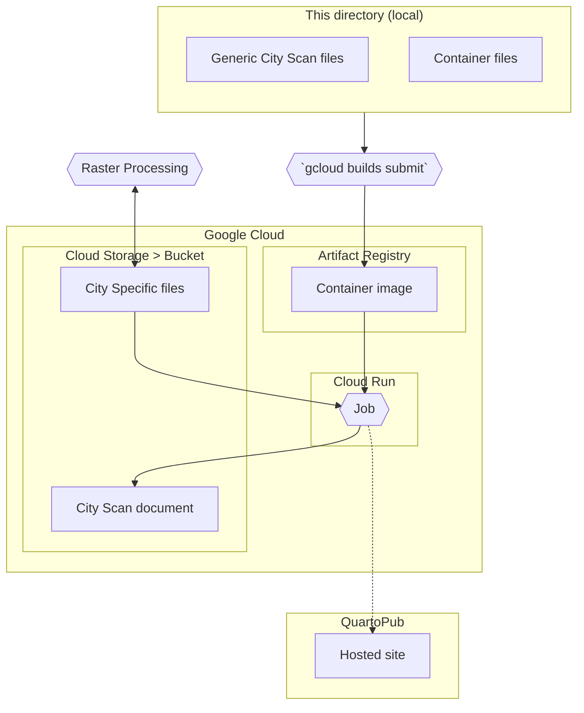

# City Scan Frontend

This directory renders a City Scan as a static site webpage from backend-generated source material (to be located in `mnt/`), using [Quarto](https://quarto.org).

The primary file is `index.qmd` which Quarto converts to HTML; `index.qmd` is a markdown document with additional capacity to execute chunks of R, Python and Observable-flavored JavaScript (OJS). (Right now the QMD is written in R and OJS but this could be easily converted to Python.)

If your computer environment is all set up for it (similarly enough to mine), you could simply render the site by running `quarto render index.qmd`.

It is likely, though, that your computer is not set up like mine, in which case: cue **docker**. Docker allows us to create an image of the necessary computing environment, with all the appropriate dependencies, for our purposes. We can run this image as a container, and in that container render the site. (See [Building contaner locally](#building-container-locally) and [Running container locally](#running-container-locally)).

But what if you don't want to run locally *at all*!? Running locally means you still need to get the raster files from somewhere, and they're being processed on Google Cloud. So that introduces the second level (third? fourth?) level of abstraction: we run the docker container on **Google Cloud**.

*(The below was written first; it could be fettled significantly.)*

## Using Google Cloud

To create the a City Scan document using Google Cloud, we execute a job on Cloud Run[^1]. The job runs a Docker container, which is built from this directory. In order to use files created previously on Google Cloud and to spit out the results for later access, we need to [*mount*](https://cloud.google.com/run/docs/tutorials/network-filesystems-fuse) the container to a Google Cloud Storage *bucket* (this mounting occurs in the `gcsfuse_run.sh` file).

[^1]: "Cloud Run is a managed compute platform that lets you run containers directly on top of Google's scalable infrastructure." ([→documentation](https://cloud.google.com/run/docs/overview/what-is-cloud-run))

This is lots of jargon! Let's illustrate and dilate the process a bit:



1. We begin with the **files necessary to render a City Scan document**. With `quarto render index.qmd` these files could be used to make the document locally.
   1. Generic files: i.e., `index.qmd`, `source/fns.R`, `source/scrollytelling.qmd`, `source/layers.yml`, `source/custom.scss`, `source/generic-text.yml`, these are the files used by every scan. These files are included in *this directory*.
   2. City-specific files: e.g. `city_inputs.yaml` and the TIFS used to make the maps. These files *are not* included in this directory.
   3. See [below](#running-locally) for how to render a City Scan document locally.
2. To ensure this document can be rendered on a different machine, we create a **Docker image**.
   1. A Docker image is a snapshot of the environment in which to run a process. With a Docker image we can provide all the dependencies required to render the City Scan (e.g. Python, R, GDAL, Quarto, etc.).
   2. The image also includes the generic files above.
   3. This image is built using the `Dockerfile` and `cloudbuild.yaml` files in this directory. These files serve as recipes for how to build the image.
   4. Google's Artifact Registry hosts the image. 
3. When we want to render the City Scan document, we run a **container**, which is a runnable incarnation of the image.
   1. On Google Cloud, to run a container we need to create a *service* or a *job*, which is tasked with this container. Because we don't need the document to be continually rendered, we create a **job**.
4. We must **mount** the container to Cloud Storage in order to use the city-specific files and to persist the container's generated files.
   1. A container is an isolated computing environment.
   2. By default, then, it does not have access to external files, and
   3. when the container's execution finishes and the container is stopped, all of its contents are gone.
   4. The mounted storage contains the city-specific files; these files have either been uploaded (e.g., `city_inputs.yaml`) or generated (e.g. TIFs). These files are not included in the Docker container because a) they are different for every city and b) they are used/made by earlier Google Cloud processes, i.e. raster processing.

### Directory Contents
#### Files for rendering the document
This directory contains the generic files necessary for creating a City Scan document. That is, it *does not* include the city-specific files, such as the TIFs or `city_inputs.yaml`. Everything in this directory could be used by multiple cities. The city-specific files are stored on Google Cloud (where they have either been uploaded, e.g., `city_inputs.yaml`, or generated, e.g., TIFs).

- `index.qmd` – The main file which Quarto builds the document from; a Quarto file (QMD) is a markdown file that can execute Python, R, and ObservableJS chunks
- `source/fns.R` – The R functions used by `index.qmd`
- `source/scrollytelling.qmd` – The ObservableJS code needed for the scrollytelling (the feature where the map layers turn on when the relevant section is scrolled to)
- `source/layers.yml` – The recipe for how each map layer is made (this may be moved out of the container and onto Google Cloud, but probably best for it to stay here with a way to override it with a file in Google Cloud Storage)
- `source/custom.scss` – The document's style sheet
- `source/generic-text.yml` – the text snippets used by all City Scans, such as methodology text and citations.

#### Files for building the container
This directory also contains the files necessary for building a Docker container and for building it specifically to Google Cloud.

- `Dockerfile` – The reciple for building the Docker container; it specifies all the necessary dependencies and includes all the required files
- `cloudbuild.yaml` – A secondary recipe file specific to building for Google Cloud
- `gcsfuse_run.sh` - The shell script that mounts the container to the Cloud Storage Bucket. It also renders the City Scan document. (These should perhaps be separeted, but it is important that the mounting process is included in the Dockerfile's `CMD` layer because we want to be able to run the container off Google Cloud and the gcsfuse step fails in a different environment, as it lacks authorization.)

### Running locally
With the addition of city-specific files, this directory could be used to render the City Scan document locally. 

At time of writing, the mount directory is `/mnt/gcs/` which has two subfolders `input/` and `output/`: the city-specific files would go in `input/`; the generated document appears in `output/`. This directory will probably be moved somewhere within the `/home` directory of the container so that it appears in the working directory locally.

To run locally,
1. place `city_inputs.yaml` and all the relevant TIFs in the `/mnt/gcs/input/` folder, and
2. run `quarto render index.qmd` from the top level of this directory

### Setting up on Google Cloud
#### Set environment variables
These variables are helpful for all of the succeeding Google Cloud commands

```sh
# Set bucket and project variables
PROJECT=city-scan-gee-test
REPO=cloud-run-source-deploy
BUCKET=crp-city-scan
IMAGE=nalgene
JOB=frontend
CITY=kenya-mombasa
MONTH=2023-10
# The city directory is the directory within the mount directory for the specific city
CITY_DIR=$MONTH-$CITY
```

#### Google Cloud Storage
*Taken from [https://cloud.google.com/run/docs/tutorials/network-filesystems-fuse](https://cloud.google.com/run/docs/tutorials/network-filesystems-fuse).*

Before building the container and deploying to Google Cloud, we need to create the Cloud Storage Bucket that the container will use:

```sh
# Create a bucket (here I am using us-central1 as the location; could choose other options)
gsutil mb -l us-central1 gs://$BUCKET
```

Within the bucket, make a subdirectory for each city (we may want to go to one bucket per city in the end), with the naming format YYYY-MM-country-city. We use `gsutil rsync` to match the contents of the bucket to `mnt/`. (See `rsync` [documentation](https://cloud.google.com/storage/docs/gsutil/commands/rsync).)

```sh
mkdir -p mnt/$CITY_DIR
mkdir -p mnt/$CITY_DIR/01-user-input
mkdir -p mnt/$CITY_DIR/02-process-output
mkdir -p mnt/$CITY_DIR/03-render-output
gsutil -m rsync -r  mnt/$CITY_DIR gs://$BUCKET/$CITY_DIR
```

#### Service account
```sh
# Create service account `fs-identiy` to "serve as the service identity"
# For explanation, see https://cloud.google.com/run/docs/securing/service-identity
gcloud iam service-accounts create fs-identity

# Grant the service account access to the Cloud Storage bucket
gcloud projects add-iam-policy-binding $PROJECT \
     --member "serviceAccount:fs-identity@$PROJECT.iam.gserviceaccount.com" \
     --role "roles/storage.objectAdmin"
```
#### Build the container
To build the container we use the `Dockerfile` and `cloudbuild.yaml`. The first is a recipe for the container, and the second is additional instructions to Google Cloud for how it should follow the recipe.

```sh
# To build with a cache, use the cloudbuild.yaml
gcloud builds submit --config cloudbuild.yaml
```

*Note that the tutorial has us build from source. This may be necessary for an initial build, though you shouldn't need to ever conduct an initial build.*

```sh
# This builds from source, without a cache
# gcloud run deploy $IMAGE --source . \
#     --execution-environment gen2 \
#     --allow-unauthenticated \
#     --service-account fs-identity \
#     --update-env-vars BUCKET=$BUCKET
```

##### Building container locally
Away from Google Cloud, if you just want to build the container locally, you could simply run `docker build -t $IMAGE .` where `$IMAGE` is the image to be run and `.` indicates the `Dockerfile` is in working directory.

#### Job creation and execution
*Taken from [https://cloud.google.com/run/docs/create-jobs](https://cloud.google.com/run/docs/create-jobs).*

```sh
# Create the job
gcloud run jobs create $JOB \
  --image us-central1-docker.pkg.dev/$PROJECT/$REPO/$IMAGE:latest \
  --max-retries 0 \
  --task-timeout 20m \
	--memory 2Gi

# Update the job with new conditions
# The default memory of 512 MiB is insufficient; how do I know how much is necessary?
gcloud run jobs update $JOB \
  --update-env-vars BUCKET=$BUCKET \
  --memory 2Gi

# Execute the job
# gcloud run jobs execute $JOB
gcloud beta run jobs execute $JOB \
	--update-env-vars CITY_DIR=$CITY_DIR
```

##### Running container locally
To run the container locally, use `docker run --rm -v "$(pwd)"/mnt:/home/mnt -e CITY_DIR=$CITY_DIR $IMAGE /home/local_run.sh` to render the document:
- `--rm` tells docker to remove the container after the run completes
- `-v "$(pwd)"/mnt:/home/mnt` mounts `/home/mnt` inside the directory to `mnt` in the working directory
- `-e CITY_DIR=$CITY_DIR` sets an environment variable `CITY_DIR` to the city-specific directory in the mount directory (see [Set environment variables](#set-environment-variables) above)
- `$IMAGE` is the name of the image to be run
- `/home/local_run.sh` at the end of the command tells docker to not use the container's default command, which would unsuccessfully connect to Google Cloud Storage, and thus fail, and instead use the local run script

Alternatively, you could interactively run the container using `docker run -it --rm -v "$(pwd)"/mnt:/home/mnt -e CITY_DIR=$CITY_DIR $IMAGE bash`:
- `-it` tells docker to run the container interactively
- `bash` replaces `/home/local_run.sh` to tell docker to simply enter a shell session instead of running a script 
